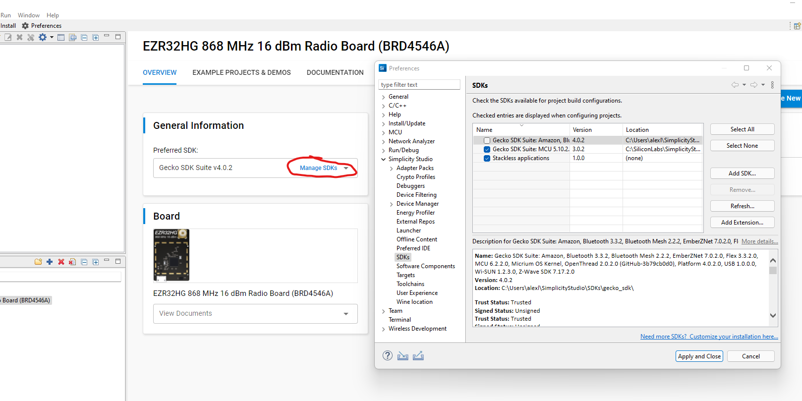

# Installation

## Install Simplicity Studio

1. Download Simplicity Studio 5 from [here](https://www.silabs.com/developers/simplicity-studio). You will need to make an account to do so.
2. For Windows, open the .iso by opening it like a folder and run setup.exe. Accept everything and click through the install wizard.
3. If it hasn't already, start Simplicity Studio. Accept all of the license agreements and let additional resources to be installed. You do not need to sign in, but it won't hurt.
4. The Installation Manager should automatically open. Select "Install by technology type".
5. Select "32-bit and Wireless MCUs" and press "Next". Keep default options, and keep pressing next and accepting licence agreements. Accept any permissions that the software needs as it installs.
6. After the install is complete, restart Simplicity Studio.

## Configure IDE for specific hardware
1. In the Get Started section, select "All Products" and type BRD4546A into the search menu. Select the top result and press "Start". This should import the correct board.
2. The board only works with an older version of the SDK. To install it select "Install" in the top left, then "Manage installed packages".


3. Select the SDKs tab, then "Install All" for the Gecko SDK 3.0. After the installation is complete, close windows until you get back to the board information.
4. In "General Information" select Manage SDKs, uncheck the Gecko SDK Suite with version 4.0.2, then select "Apply and close".


5. The "Prefered SDK" should now be Gecko SDK Suite v3.0.2. If so, you should now be able to create new projects from examples with out issues.

## Configure IDE for Git
The IDE is based on Eclipse, but git integration is not included by default. By using the IDE integration, the .gitignore is generated automatically as different builds are done.
1. Press Ctrl + 3, then type and select "Install New Software...".
2. Paste ```http://download.eclipse.org/egit/updates-5.13/``` into the "Work with:" field, then press "Add..". Give a name like egit, then press "Add".
3. Only select 'Git integration for Eclipse', then click through the rest of the wizard, agreeing to the licence agreements and certificate.
4. Restart Simplicity Studio.
5. There should now be an option for Window > Perspective > Git. Select this option.
6. On the left, select the option "Clone a Git repository".
7. Paste the URL for the repository in the "URI" field at the top. This should populate "Host" and "Repository path".
8. Fill in your username and password in the "Authentication" field. If your password doesn't work, you might need to [generate a token](https://github.com/settings/tokens).
9. Click through the rest of the dialog until the repository is cloned and shows up in the left panel.
10. Right click on the repository, then select "Import Projects...".
11. The correct project should automatically be selected. Just press "Finish".
12. Switch back to the standard view by going to Window > Perspective > C/C++, or by selecting C/C++ in the top right corner.
13. Test installation by selecting Project > Build Project, then you're ready to go!